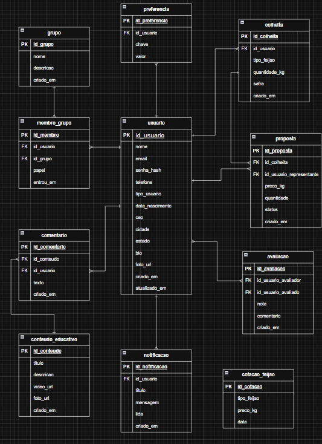

# Especificações do Projeto

Definição do problema e ideia de solução a partir da perspectiva do usuário.

## Usuários

| Tipo de Usuário             | Descrição                                    | Responsabilidades                                                                                            |
| --------------------------- | -------------------------------------------- | ------------------------------------------------------------------------------------------------------------ |
| **Produtor Rural**          | Usa a aplicação para suas tarefas principais | Registrar colheita, classificar feijão, criar e entrar em grupos, assistir conteúdo educativo, ver propostas |
| **Representante Comercial** | Conecta-se com os produtores rurais          | Enviar proposta                                                                                              |

## Arquitetura e Tecnologias

Para o desenvolvimento da solução serão adotadas as seguintes tecnologias:

**Front end:** React
**Back end:** NodeJS
**Banco de Dados:** Convex

## Project Model Canvas

## Requisitos

As tabelas que se seguem apresentam os requisitos funcionais e não funcionais que detalham o escopo do projeto.

### Requisitos Funcionais

| ID     | Descrição do Requisito                                                                        | Prioridade |
| ------ | --------------------------------------------------------------------------------------------- | ---------- |
| RF-001 | Permitir que o usuário cadastre sua conta                                                     | ALTA       |
| RF-002 | Permitir que o usuário faça login                                                             | ALTA       |
| RF-003 | Permitir que o usuário recupere a senha                                                       | ALTA       |
| RF-004 | Permitir que o usuário edite as informações do seu perfil                                     | ALTA       |
| RF-005 | Permitir que o usuário edite as suas preferências do sistema                                  | ALTA       |
| RF-006 | Permitir que o usuário classifique feijão carioca usando IA                                   | ALTA       |
| RF-007 | Permitir que o Produtor Rural registre a colheita                                             | ALTA       |
| RF-008 | Permitir que o Produtor Rural participe de grupos                                             | ALTA       |
| RF-009 | Permitir que o Produtor Rural visualize propostas comerciais                                  | ALTA       |
| RF-010 | Permitir que o Produtor Rural visualize conteúdos educativos                                  | ALTA       |
| RF-011 | Permitir que o Produtor Rural visualize a cotação diária do feijão carioca                    | MÉDIA      |
| RF-012 | Permitir que o Representante Comercial visualize colheitas                                    | MÉDIA      |
| RF-013 | Permitir que o Representante Comercial envie propostas comerciais                             | MÉDIA      |
| RF-014 | Permitir que o Produtor Rural interaja com um assistente virtual especializado em agricultura | BAIXA      |
| RF-015 | Permitir que o Produtor Rural comente conteúdos educativos                                    | BAIXA      |
| RF-016 | Permitir que usuários avaliem outros usuários                                                 | BAIXA      |
| RF-017 | Permitir que usuários recebam notificacões                                                    | BAIXA      |

### Requisitos não Funcionais

| ID      | Descrição do Requisito                                                                 | Prioridade |
| ------- | -------------------------------------------------------------------------------------- | ---------- |
| RNF-001 | O sistema deve possuir interface totalmente responsiva                                 | ALTA       |
| RNF-002 | O sistema deve atingir uma score de acessibilidade 90+ na ferramenta Google Lighthouse | ALTA       |
| RNF-003 | O design do sistema deve seguir os preceitos _Mobile First_                            | ALTA       |
| RNF-004 | O sistema deve funcionar integralmente em um cenário de conexão por dados móveis       | ALTA       |
| RNF-004 | O sistema deve funcionar na versão mobile dos navegadores Chrome e Safari              | ALTA       |

## Restrições

O projeto está restrito pelos itens apresentados na tabela a seguir.

| ID  | Restrição                                                                           |
| --- | ----------------------------------------------------------------------------------- |
| 01  | O projeto deverá ser entregue até o final do mês 11/2025                            |
| 02  | Cada integrante do projeto deve estar responsável, minimamente, por dois requisitos |

## Diagrama de Caso de Uso

## Projeto da Base de Dados

